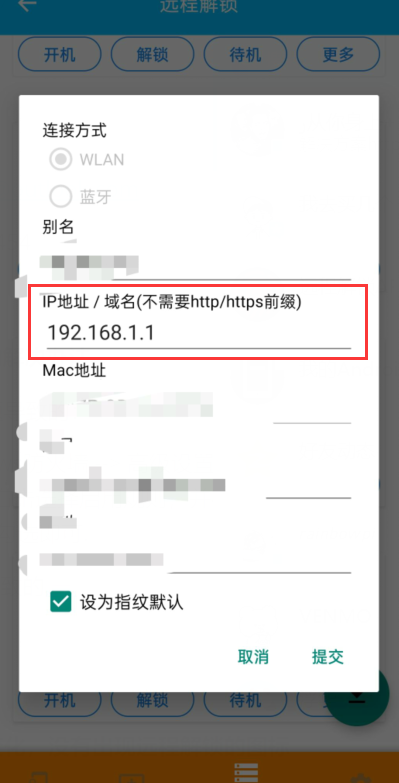
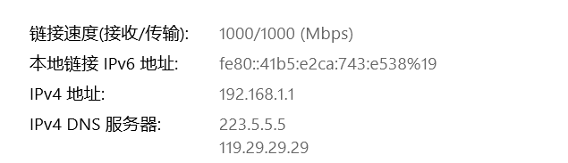

#### 联系我们：

Email：ryan.h.qin@outlook.com

QQ群:      1053768454

#### 常见问题：

##### 1.一直显示查找ip的解决办法

1.可能是防火墙问题导致的：

>  解决方案Windows防火墙 --> 高级设置 --> 入站规则 --> 在列表里找到“文件和打印机共享(回显请求 - ICMPv4-In)” --> 右击选择启用规则，并在其属性里设置为‘允许连接'--> 确定 --> 大功告成。
> 要禁止ping,去掉勾选即可.

2.由于ip设置错误导致的(下一版本修复)

>解决方案：
>
>1.检查电脑和手机是否在同一局域网
>
>2.检查App中使用的ip与电脑当前ip是否一致
>
>检查方法如下：
>
>App点击管理-》选择设备-》查看更多-》ip:
>
>
>
>win10直接打开网络和Internet设置查看:
>
>

##### 2.锁屏界面无任何变化，没有出现远程解锁的图标

手动添加注册表信息，双击Register.reg一直点是就行了。如果仍然没有显示在登录界面，请检查是否安装VC Redistributable for 2017。安装2.0版本前请先卸载2.0以下的版本。

##### 3.Windows 7 安装了Windows10 版本导致锁屏界面一直闪烁

遇到这种情况，进入修复环境，打开命令行选项用del命令删除安装目录下RemoteFingerUnlockModule.dll文件即可。

##### 4.锁屏界面提示用户名密码错误

1.请检查你输入的是密码而不是**pin**。

2.如果有更改过微软账户密码，可能是本地密码和在线密码不同步导致的

> 建议您参考以下步骤：
>
> 方案一：直接重新绑定微软账户和本地账户
>
> 方案二：
>
> 1.按Windows徽标 + R组合键调出运行窗口，在其中输入“control userpasswords2 ”或“netplwiz”，打开“用户帐户”窗口，
>
> 2.选中需要操作的帐户，重新勾选“要使用本计算机，用户必须输入用户名和密码”，然后“应用”；然后再取消勾选“要使用本计算机，用户必须输入用户名和密码”，再点击“应用”，就会弹出自动登录设置窗口了。在其中输入微软帐户的新密码，然后点击“确定”关闭“自动登录”设置窗口，最后点击“用户帐户”窗口的“确定”按钮。
>
> [https://answers.microsoft.com/zh-hans/windows/forum/all/microsoft%E8%B4%A6%E5%8F%B7%E7%99%BB%E5%BD%95/092f9d9c-909e-4f7f-8fab-5e4169480960](https://answers.microsoft.com/zh-hans/windows/forum/all/microsoft%E8%B4%A6%E5%8F%B7%E7%99%BB%E5%BD%95/092f9d9c-909e-4f7f-8fab-5e4169480960)